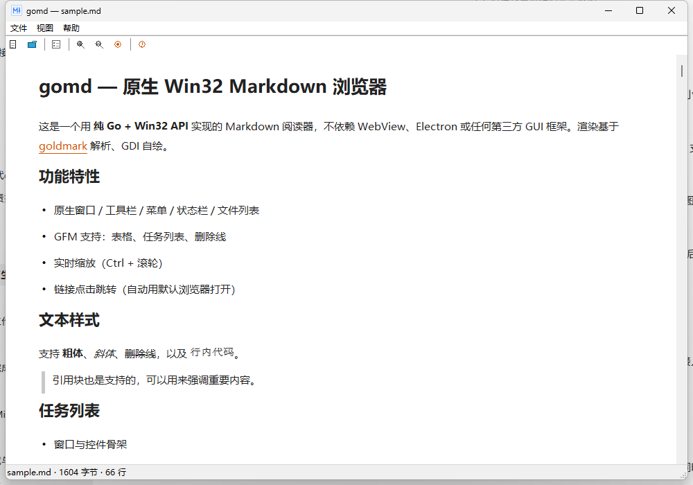
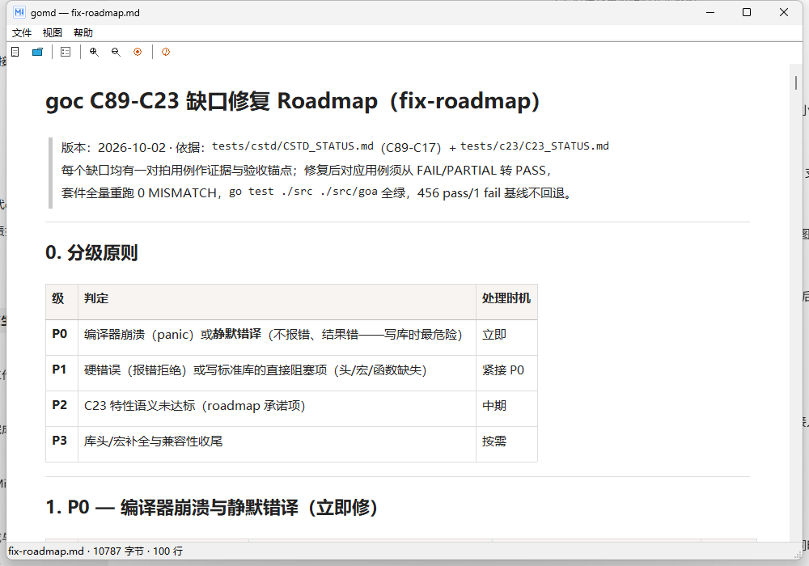
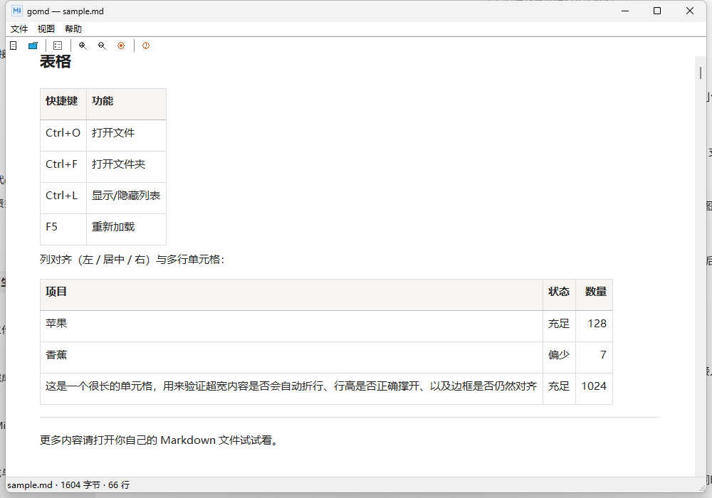
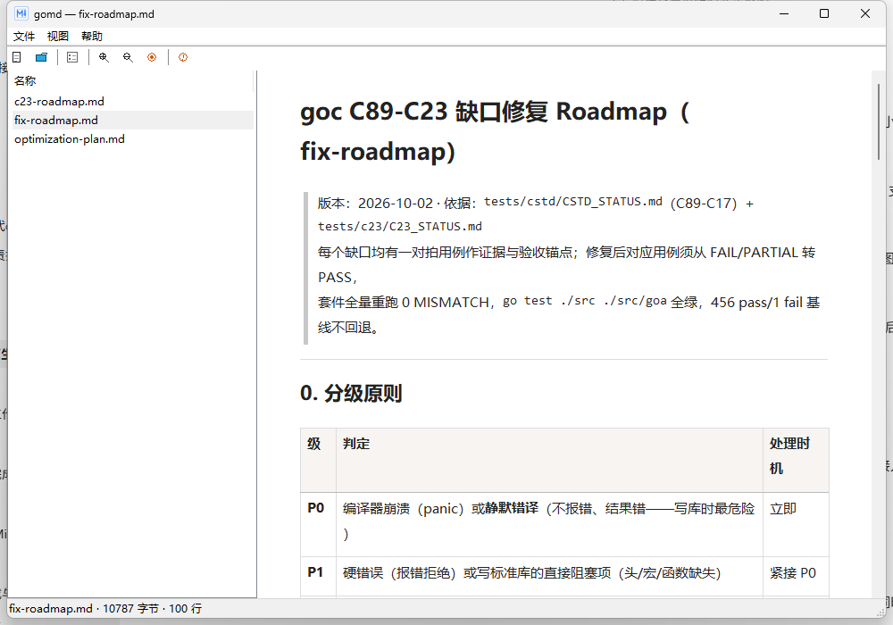

# gomd — 原生 Win32 Markdown 浏览器

一个用 **纯 Go + Win32 API** 编写的 Windows 桌面 Markdown 阅读器。
不依赖 WebView、Electron 或任何第三方 GUI 框架：解析用
[goldmark](https://github.com/yuin/goldmark)（GFM），渲染全部通过 GDI 自绘完成。



## 功能

- **GFM 渲染**：标题、列表、任务列表、引用、代码块、行内样式、表格（列对齐 / 跨行单元格）、链接
- **文件拖放**：把 `.md` 文件拖进窗口即可打开
- **文本选择与复制**：鼠标拖选（跨行、跨段落），`Ctrl+C` 复制、`Ctrl+A` 全选（"编辑"菜单亦有入口）；折行处不会产生多余换行
- **文件列表**：左侧列出当前文件夹的 Markdown 文件（默认折叠，`Ctrl+L` 或工具栏按钮展开）
- **记住上次目录**：打开对话框自动定位到上次使用的目录（存于注册表 `HKCU\Software\gomd`）
- **原生打开对话框**：`GetOpenFileNameW`（即 Windows OpenFileDialog），异常时自动回退自绘对话框
- **缩放**：`Ctrl+滚轮` / 工具栏按钮，实时重排版
- **现代外观**：manifest 启用 Common Controls v6 与 DPI 感知

| 拖放打开 | 表格渲染 |
| --- | --- |
|  |  |

| 文件列表（单列） | 打开对话框（记住目录） |
| --- | --- |
|  |  |

## 快捷键

| 快捷键 | 功能 |
| --- | --- |
| `Ctrl+O` | 打开文件 |
| `Ctrl+F` | 打开文件夹 |
| `Ctrl+L` | 显示/隐藏文件列表 |
| 鼠标拖选 + `Ctrl+C` / `Ctrl+A` | 选择并复制文本 / 全选 |
| `Ctrl+滚轮` / `Ctrl+=` / `Ctrl+-` / `Ctrl+0` | 缩放 / 重置 |
| `F5` | 重新加载 |

## 构建

依赖：Go 1.21+（Windows）；可选 windres（MSYS2/MinGW 自带，用于图标与 manifest）。

```bash
./build.sh
```

或手动执行：

```bash
# 资源（图标 + manifest）→ gomd.syso，Go 会自动链接
(cd resources && windres gomd.rc -O coff -o ../src/gomd.syso)

# 编译
go build -trimpath -ldflags="-s -w -H windowsgui" -o dist/gomd.exe ./src
```

> 关于 `-mwindows`：那是 MinGW/gcc 的链接参数，作用是把 PE 子系统设为 GUI
> （启动时无控制台黑窗口）。Go 的等价参数是 `-ldflags="-H windowsgui"`，
> 两者效果一致，本项目使用后者。

产物在 `dist/gomd.exe`（约 1.5 MB，可再经 UPX 压缩）。

## 目录结构

```
gomd/
├── build.sh          # 一键构建脚本
├── src/              # 全部 Go 源码与测试
│   ├── app.go        # 入口、主窗口、消息循环
│   ├── win32.go      # Win32 API 声明与封装
│   ├── render.go     # goldmark 解析 + GDI 排版/绘制
│   ├── ui.go         # 工具栏/菜单/列表/文件操作
│   ├── dlg.go        # 打开文件对话框
│   ├── settings.go   # 配置（注册表）
│   └── *_test.go     # 单元测试 / 离屏渲染测试
├── resources/        # gomd.rc / gomd.ico / gomd.manifest
├── tools/
│   ├── mkicon/       # 生成应用图标 gomd.ico
│   └── scap/         # 开发辅助：启动应用并截图验证
├── docs/             # 文档、示例 sample.md、截图
└── dist/             # 构建产物（git 忽略）
```

## 测试

```bash
go test ./src/...
```

包含结构体尺寸/偏移校验（防 ANSI/Unicode 混用）、表格 AST 解析、配置持久化、
离屏渲染（CreateDIBSection）回归等。

## 配置

`记住上次打开的目录`存储在注册表 `HKCU\Software\gomd\LastFolder`，
不产生任何散落配置文件。

## License

[MIT](LICENSE)
