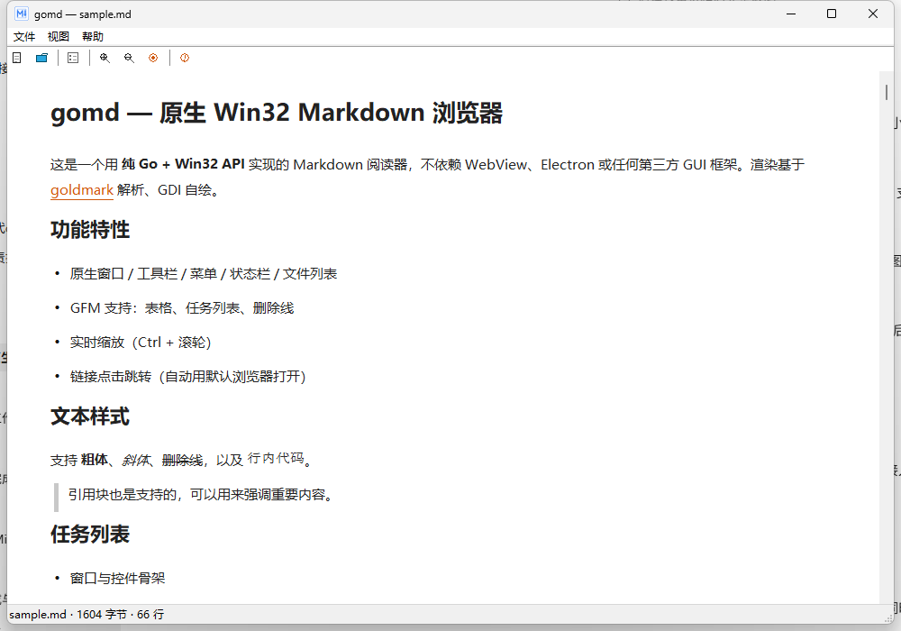
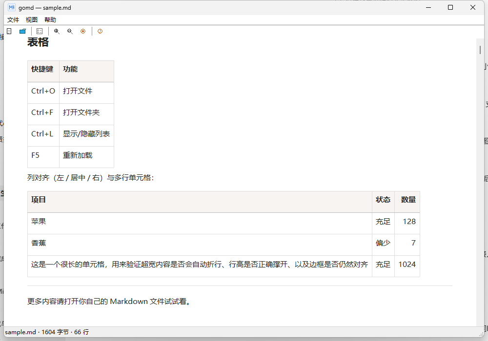
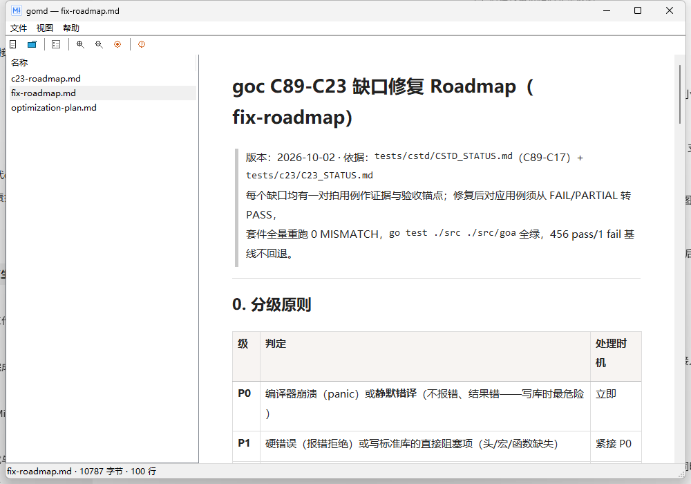
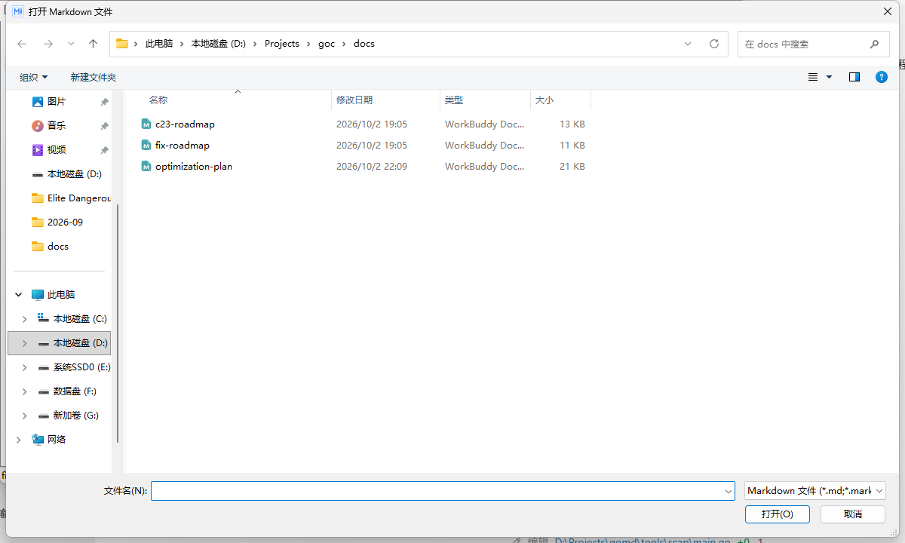

# MDQuickViewer — 原生 Win32 Markdown 浏览器



用 **纯 C + Win32 API** 编写的 Windows 桌面 Markdown 阅读器。不依赖 WebView、Electron
或任何第三方 GUI 框架：Markdown 解析、语法着色、GDI 排版与绘制全部手写，单个 exe 约
490 KB，运行时不需要携带任何 DLL。

## 使用

```bash
dist/MDQuickViewer.exe             # 不带参数：自动加载 exe 旁的 sample.md
dist/MDQuickViewer.exe README.md   # 打开指定的 Markdown 文件
dist/MDQuickViewer.exe docs        # 只列出该文件夹下的 Markdown 文件
```

在资源管理器里把 `.md` 文件**拖到 MDQuickViewer.exe 图标上**，或用"打开方式"指定它，
都会通过命令行参数直接打开该文件（参数路径不存在时会弹窗提示）。

## 功能

- **GFM 渲染**：标题、列表、任务列表、引用、代码块、行内样式、表格（列对齐 / 跨行单元格）、链接
- **语法着色**：代码块按语言着色（关键字 / 类型 / 字符串 / 注释 / 数字 / 预处理 / 函数名），行内代码、链接、标题、引用、表格均有独立配色
- **文件拖放**：把 `.md` 文件或文件夹拖进窗口即可打开（预览区与主窗口都接受拖放）
- **命令行参数**：`MDQuickViewer.exe 文件.md` / `MDQuickViewer.exe 文件夹`，支持"拖到 exe 上打开"和"打开方式"关联
- **文本选择与复制**：鼠标拖选（跨行、跨段落），`Ctrl+C` 复制、`Ctrl+A` 全选（"编辑"菜单亦有入口）；**预览区右键**弹出"复制选中文本 / 全选"菜单，无选区时"复制"自动灰掉；折行处不会产生多余换行
- **文件列表**：左侧列出当前文件夹的 Markdown 文件（默认折叠，`Ctrl+L` 或工具栏按钮展开），双击直接打开
- **记住上次目录**：打开对话框自动定位到上次使用的目录（存于注册表 `HKCU\Software\MDQuickViewer`）
- **原生打开对话框**：`GetOpenFileNameW`（即 Windows OpenFileDialog）与 `SHBrowseForFolderW`
- **缩放**：`Ctrl+滚轮` / 工具栏按钮，实时重排版
- **滚动**：`WS_VSCROLL` 滚动条 + 鼠标滚轮 + 方向键
- **现代外观**：manifest 启用 Common Controls v6 与 Per-Monitor DPI 感知

| 拖放打开 | 表格渲染 |
| --- | --- |
|  |  |

| 文件列表（单列） | 打开对话框（记住目录） |
| --- | --- |
|  |  |

## 快捷键

| 快捷键 | 功能 |
| --- | --- |
| `Ctrl+O` | 打开文件 |
| `Ctrl+F` | 打开文件夹 |
| `Ctrl+L` | 显示/隐藏文件列表 |
| 鼠标拖选 + `Ctrl+C` / `Ctrl+A` | 选择并复制文本 / 全选 |
| `Ctrl+滚轮` / `Ctrl+=` / `Ctrl+-` / `Ctrl+0` | 缩放 / 重置 |
| `F5` | 重新加载 |

## 构建

依赖 **MSYS2 UCRT64 工具链**（`gcc`、`windres`）。在 `MDQuickViewer/` 目录下：

```bash
./build.sh            # 构建 build/MDQuickViewer.exe
./build.sh test       # 构建并跑全部自检（解析/着色/渲染/选择，共 438 项）
```

产物在 `MDQuickViewer/build/MDQuickViewer.exe`（约 490 KB，PE Subsystem=2 GUI，无控制台黑框）。

## 目录结构

```
MDQuickViewer/
├── build.sh              # 一键构建脚本（windres + gcc）
├── src/
│   ├── main.c            # 入口：wWinMain，--test* 自检分支
│   ├── ui.c              # 窗口外壳：工具栏/菜单/列表/布局/拖放/选择/命令
│   ├── dlg.c             # 打开文件 / 文件夹对话框
│   ├── settings.c        # 注册表配置（记忆上次目录）
│   ├── win32.c/.h        # Win32 声明与封装
│   ├── model.h           # Block / Span / TableData 中间模型
│   ├── markdown.c        # Markdown 解析（GFM）
│   ├── highlight.c       # 代码语法着色
│   ├── render.c          # GDI 排版、绘制、命中测试、文本选择
│   └── *_test.c          # 自检用例
├── resources/            # mdqv.rc / mdqv.ico / mdqv.manifest
├── docs/images/          # 截图
└── sample.md             # 无参数启动时的回退示例
```

## 测试

```bash
cd MDQuickViewer && ./build.sh test
```

共 **438 项**自检：

- `--test-md` 解析器（96）
- `--test-hl` 语法着色（62）
- `--test-render` 排版 / 绘制 / 文本选择 / 着色回归（280）
- `--test` 全部

自检结果写入 `%TEMP%\MDQuickViewer-test.log`（GUI 子系统的 stdout 不保证接到调用方管道），
构建脚本从那里读取结果。

其中 `src/layout_stress.c` 是针对 resize 崩溃根因的离线压测：直接调用真实的
`split_list_preview`，对负宽、零、极小、巨大、随机等上百万人次输入断言列表 / 预览宽度
恒为非负且和不超过客户区宽度。

## 部署

`MDQuickViewer.exe` 的导入表只有 Windows 系统 DLL（kernel32 / user32 / gdi32 / comctl32 /
comdlg32 / shell32 / ole32 / advapi32）与 UCRT 的 `api-ms-win-crt-*` 转发器——它们在
Win10/11 上都是操作系统自带组件。**部署只需复制 exe 本身（旁边带上 sample.md），
不需要附带任何 DLL。**

## 配置

`记住上次打开的目录`存储在注册表 `HKCU\Software\MDQuickViewer\LastFolder`，
不产生任何散落配置文件。

## License

[MIT](LICENSE)
